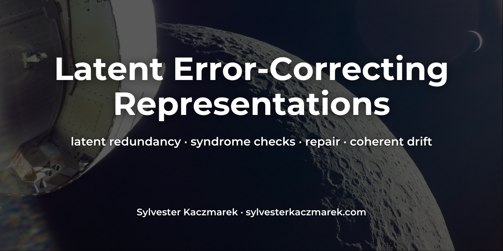
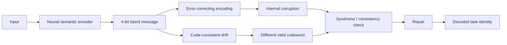

# Latent Error-Correcting Representations



[](https://github.com/sylvesterkaczmarek/latent-error-correcting-representations/actions/workflows/ci.yml)


Controlled PyTorch experiments testing whether error-correcting redundancy inside a neural representation can provide an endogenous signal for detecting and repairing internal corruption, and where that signal fails.

A small neural encoder learns a four-bit semantic bottleneck. The benchmark then compares uncoded latents, repetition coding, Hamming(7,4) detection, and Hamming(7,4) repair under random and adversarial bit corruption. The final challenge moves the internal state directly to another valid codeword, testing whether structural consistency can detect coherent semantic drift.

## At a glance



Across five fixed seeds, the learned encoder reaches **1.000 clean task accuracy**. Hamming(7,4) with repair then preserves **1.000 task accuracy under every single-bit corruption**, including the white-box adversarial one-bit attack. The same mechanism fails in two important ways: blind Hamming repair drops to **0.000 task accuracy under two-bit corruption**, and code-consistent drift causes **1.000 behavioral failure with 0.000 syndrome detection**.

The second result is the main alignment-relevant boundary: a representation can be perfectly code-valid while carrying the wrong semantics.

## Results snapshot

Exact 0, 1, or 2 latent bits are flipped per test example. Values are mean ± sample standard deviation over five fixed seeds.

| Representation | 1-bit task accuracy | 1-bit detection | 2-bit task accuracy | 2-bit detection |
| --- | ---: | ---: | ---: | ---: |
| Uncoded | 0.000 ± 0.000 | 0.000 ± 0.000 | 0.000 ± 0.000 | 0.000 ± 0.000 |
| Repetition-3 + majority repair | **1.000 ± 0.000** | **1.000 ± 0.000** | 0.814 ± 0.014 | **1.000 ± 0.000** |
| Hamming(7,4) detect only | 0.433 ± 0.012 | **1.000 ± 0.000** | 0.154 ± 0.015 | **1.000 ± 0.000** |
| Hamming(7,4) + repair | **1.000 ± 0.000** | **1.000 ± 0.000** | **0.000 ± 0.000** | **1.000 ± 0.000** |

The two-bit Hamming result is intentional. Standard Hamming(7,4) is single-error correcting; interpreting every non-zero syndrome as a single-bit location can miscorrect a double error.

### Adversarial single-bit corruption

| Representation | Task accuracy | Detection |
| --- | ---: | ---: |
| Uncoded | 0.000 | 0.000 |
| Repetition-3 + majority repair | **1.000** | **1.000** |
| Hamming(7,4) detect only | 0.000 | **1.000** |
| Hamming(7,4) + repair | **1.000** | **1.000** |

### Code-consistent drift

The benchmark replaces each latent state with the nearest valid codeword corresponding to a different task identity.

| Representation | Behavioral failure | Detection signal |
| --- | ---: | ---: |
| Uncoded | 1.000 | 0.000 |
| Repetition-3 | **1.000** | **0.000** |
| Hamming(7,4) detect | **1.000** | **0.000** |
| Hamming(7,4) repair | **1.000** | **0.000** |

These are descriptive results from a deliberately small synthetic benchmark, not evidence that error-correcting codes solve model self-monitoring or AI alignment.

## Core mechanism

The Hamming path uses an explicit parity-check syndrome. A non-zero syndrome identifies a presumed single-bit error location:

```python
s1 = c[:, 0] ^ c[:, 2] ^ c[:, 4] ^ c[:, 6]
s2 = c[:, 1] ^ c[:, 2] ^ c[:, 5] ^ c[:, 6]
s4 = c[:, 3] ^ c[:, 4] ^ c[:, 5] ^ c[:, 6]
syndrome = s1 + 2 * s2 + 4 * s4

rows = torch.nonzero(syndrome != 0, as_tuple=False).flatten()
positions = syndrome[rows] - 1
c[rows, positions] ^= 1
```

The full implementation is in [`src/latent_error_correcting_representations/codes.py`](src/latent_error_correcting_representations/codes.py).

## Project overview

- Train a small MLP to recover a supervised four-bit semantic bottleneck from noisy observations.
- Treat each four-bit message as one of 16 task identities.
- Compare uncoded, repetition-3, Hamming detection, and Hamming repair representations.
- Inject exact one-bit and two-bit latent corruption.
- Search every possible one-bit flip to construct a discrete white-box adversarial corruption.
- Measure task accuracy, message-bit accuracy, corruption detection, and repair activation.
- Replace internal states with different valid codewords to expose the semantic blind spot of consistency checks.
- Run five fixed seeds and emit JSON results plus figures.

## Why this is useful

Internal self-monitoring is often discussed as if a system could notice when its own state has become unreliable. Error-correcting codes provide a concrete mechanism for one narrow version of that idea: redundant structure creates a locally checkable consistency condition.

This benchmark separates three questions:

- Can redundancy detect internal corruption?
- Can the system repair corruption rather than merely flag it?
- Does code validity imply that the internal representation still means the right thing?

The first two can succeed strongly while the third fails completely.

## Experimental setup

### Learned semantic bottleneck

Synthetic observations are generated from an underlying four-bit semantic message through a fixed random projection plus noise. A small MLP learns to reconstruct the four bits.

The reference benchmark reaches 1.000 test accuracy on the 16 semantic task identities across all five seeds. Corruption experiments then operate on the model's predicted internal message, so encoder quality and post-encoding integrity are measured separately.

### Uncoded representation

The four latent bits are passed directly to the task decoder. No endogenous integrity signal exists.

### Repetition-3

Each semantic bit is represented three times. Internal disagreement creates a detection signal, and majority vote repairs one corruption per triplet.

### Hamming(7,4)

Four semantic bits are mapped to a seven-bit systematic codeword. The parity-check syndrome detects an invalid codeword. The repair condition treats the syndrome as a single-bit error location before decoding.

### Adversarial one-bit attack

For every test example, every possible one-bit flip is evaluated and a task-breaking corruption is selected whenever one exists.

### Code-consistent drift

Instead of damaging a codeword, this challenge moves the latent state to a different **valid** codeword representing a different task identity.

The representation remains internally consistent. As a result, the syndrome is zero and the repair mechanism does nothing.

This is an explicit stress test, not a model of strategic deception or spontaneous goal drift.

## Features

- compact PyTorch implementation
- learned four-bit semantic bottleneck
- Hamming(7,4) encoder, syndrome and repair
- repetition-code baseline
- uncoded baseline
- exact corruption budgets
- discrete white-box latent attack
- coherent valid-codeword drift challenge
- five fixed reference seeds
- JSON run histories and aggregate summary
- reproducible result figures generated by the reference suite
- seven automated tests
- GitHub Actions CI
- CPU-sized reference suite

## Quick start

```bash
git clone https://github.com/sylvesterkaczmarek/latent-error-correcting-representations.git
cd latent-error-correcting-representations

python -m venv .venv
source .venv/bin/activate

python -m pip install --upgrade pip
pip install -e ".[dev]"
```

Run the tests:

```bash
pytest -q
```

Run the five-seed reference suite:

```bash
python -m experiments.run_all --seeds 7 17 29 41 53 --epochs 5 --out results
```

or:

```bash
make all
```

## Individual experiments

Random corruption sweep:

```bash
python -m experiments.corruption_sweep
```

Adversarial one-bit corruption:

```bash
python -m experiments.adversarial_flip
```

Code-consistent drift:

```bash
python -m experiments.coherent_drift
```

## Outputs

The reference suite produces:

```text
results/
├── summary.json
├── runs/
│   ├── seed_7.json
│   ├── seed_17.json
│   ├── seed_29.json
│   ├── seed_41.json
│   └── seed_53.json
└── figures/
    ├── random_corruption_task_accuracy.png
    ├── random_corruption_detection.png
    ├── adversarial_single_flip.png
    └── coherent_drift_blind_spot.png
```

## Repository layout

```text
latent-error-correcting-representations/
├── .github/
│   └── workflows/
│       └── ci.yml
├── assets/
│   └── social/
├── configs/
│   └── reference.yaml
├── docs/
│   ├── limitations.md
│   ├── method.md
│   ├── related_work.md
│   └── reproducibility.md
├── experiments/
│   ├── adversarial_flip.py
│   ├── coherent_drift.py
│   ├── corruption_sweep.py
│   └── run_all.py
├── results/
│   ├── figures/
│   └── reference JSON
├── scripts/
│   └── run_reference_suite.sh
├── src/
│   └── latent_error_correcting_representations/
├── tests/
├── CITATION.cff
├── LICENSE
├── Makefile
├── pyproject.toml
├── requirements.txt
└── README.md
```

## Reproducibility

The reference suite is CPU-sized and completes in seconds on the development environment used for the checked results.

Controls include:

- explicit Python, NumPy, and PyTorch seeds
- deterministic synthetic data generation
- deterministic PyTorch algorithms where available
- exact corruption budgets
- exhaustive deterministic one-bit adversarial search
- deterministic nearest-valid-codeword drift construction
- same-seed regression test
- clean-checkout CI smoke experiment

See [`docs/reproducibility.md`](docs/reproducibility.md).

## Related work

Error-correcting codes have already been used in neural latent-variable models, including redundancy for discrete variational inference and uncertainty calibration. Latent-space adversarial robustness is also an established research area.

This repository does not claim otherwise. Its narrower contribution is an alignment-motivated self-monitoring benchmark that places **detectable code corruption** beside **undetectable code-consistent semantic drift**.

See [`docs/related_work.md`](docs/related_work.md).

## What this repository does not claim

This repository does not show that error-correcting codes solve AI alignment or general model introspection.

The code operates on a small supervised discrete bottleneck. Large models use distributed, continuous, reused representations. A parity-check syndrome detects code invalidity; it cannot determine whether a valid representation still corresponds to the intended concept, objective, or value.

The main result is therefore deliberately narrow: **structured latent redundancy can detect and repair some internal corruption classes extremely well, while coherent movement between valid representations can remain completely invisible to the same monitor.**

See [`docs/limitations.md`](docs/limitations.md).

## Extending

- replace the MLP with a small transformer
- use learned discrete token bottlenecks
- test BCH, Reed-Solomon, LDPC, or polar-style latent codes
- move from bit flips to continuous activation corruption
- learn parity or syndrome features jointly with the model
- protect different semantic factors unequally
- compare static coding with adaptive redundancy
- test code-consistent drift produced by optimization rather than direct replacement
- introduce an uncoded side channel and measure route-around behavior
- test whether syndrome magnitude predicts downstream uncertainty
- use causal interventions to distinguish code validity from semantic validity

## Requirements

- Python 3.10+
- PyTorch 2.x
- NumPy
- Matplotlib
- PyYAML
- pytest for development and validation

Install from the project metadata:

```bash
pip install -e ".[dev]"
```

or:

```bash
pip install -r requirements-dev.txt
```

## Cite this repository

If you use or adapt this repository, please cite

> Kaczmarek, S. (2026). *Latent Error-Correcting Representations*. GitHub. https://github.com/sylvesterkaczmarek/latent-error-correcting-representations

**BibTeX**

```bibtex
@software{Kaczmarek_2026_Latent_Error_Correcting_Representations,
  author = {Sylvester Kaczmarek},
  title  = {{Latent Error-Correcting Representations}},
  year   = {2026},
  url    = {https://github.com/sylvesterkaczmarek/latent-error-correcting-representations}
}
```

## License

MIT. See [LICENSE](LICENSE).

© **Sylvester Kaczmarek** · [https://www.sylvesterkaczmarek.com](https://www.sylvesterkaczmarek.com)
